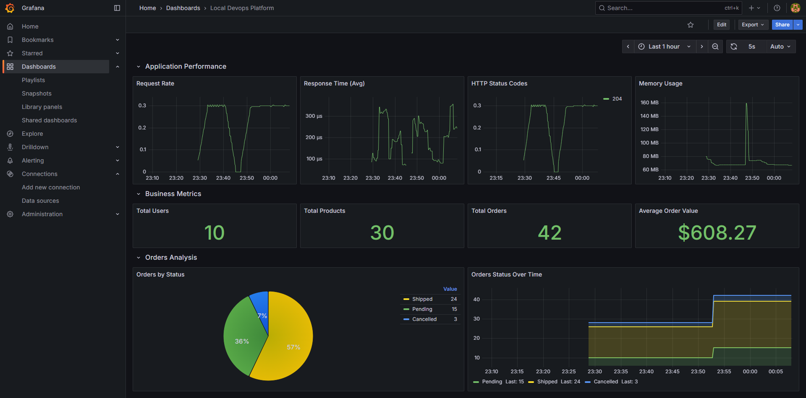
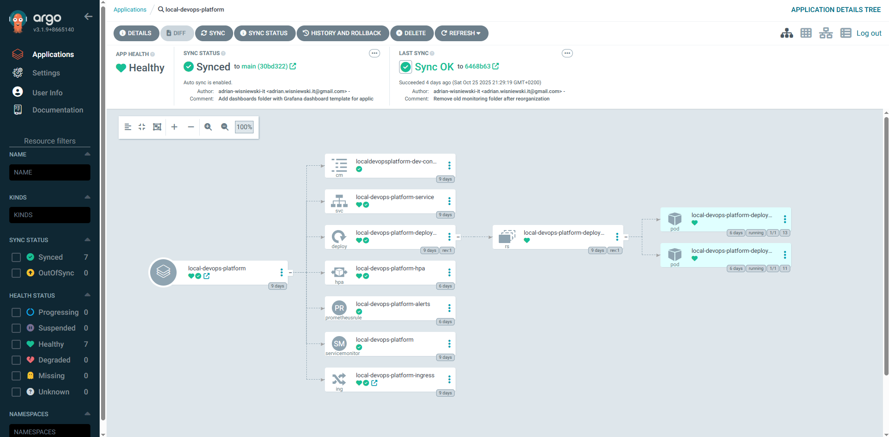
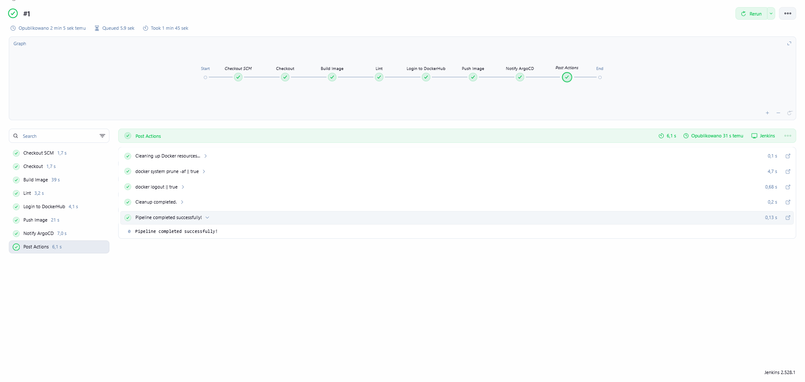

# Local DevOps Platform

## Overview

This project demonstrates a complete DevOps pipeline with automated CI/CD, GitOps deployment, and full monitoring stack. It shows how to build, test, deploy, and monitor a containerized application.

The platform uses **Jenkins** for continuous integration, **ArgoCD** for GitOps-based deployment, and **Prometheus + Grafana + Loki** for monitoring and logging. All infrastructure is managed with **Helm charts** for easy deployment and updates.

**Tech Stack:** Flask · PostgreSQL · Docker · Jenkins · Helm · Kubernetes (MicroK8s) · ArgoCD · Prometheus · Grafana · Loki · Bash

## Key Features

### CI/CD Automation
- **Jenkins pipeline** builds, lints, and pushes Docker images to Docker Hub
- Docker Hub credentials stored securely in Jenkins
- Jenkins notifies **ArgoCD** to refresh and deploy the updated application

### GitOps Deployment
- **ArgoCD** automatically syncs Kubernetes manifests from Git repository
- Self-healing enabled - cluster state always matches Git state
- Supports rollback to previous versions through ArgoCD

### Kubernetes Orchestration
- **Helm chart** manages all application components and configuration
- **Horizontal Pod Autoscaler** scales between 2-5 replicas based on CPU and memory
- Health checks with readiness and liveness probes
- Rolling updates for new deployments
- Resource requests and limits ensure stable performance

### Monitoring & Observability
- **Prometheus** collects metrics from application and Kubernetes cluster
- **Grafana dashboard** visualizes application performance and business metrics
- **Loki** aggregates logs from all pods for centralized troubleshooting
- Custom application metrics:
  - Total users, products, and orders
  - Average order value
  - Orders by status (pending, shipped, cancelled)
- Automated alerts for:
  - Application downtime (>1 minute)
  - High CPU usage (>80%)
  - High memory usage (>200MB)

### Security & Configuration
- Database credentials stored in **Kubernetes Secrets**
- Application config managed with **ConfigMaps**
- Secrets excluded from Git repository

### Automated Setup
- Bash scripts automate complete environment deployment:
  - Environment (Docker, MicroK8s, Helm)
  - Helm repositories
  - PostgreSQL database with sample data
  - Jenkins CI/CD pipeline
  - ArgoCD GitOps deployment
  - Monitoring stack (Prometheus, Grafana, Loki)

## Prerequisites

- Ubuntu 20.04+ (or compatible Linux distribution)
- 4GB+ RAM recommended

## Quick Start

1. Clone the repository:
```bash
git clone https://github.com/adrian-wisniewski-it/local-devops-platform.git
cd local-devops-platform
```

2. Run automated setup:
```bash
sudo bash scripts/run_all.sh
```

3. Access the services:
   - **Application:** http://localdevopsplatform.local
   - **Jenkins:** http://localhost:8080
   - **ArgoCD:** http://argocd.local
   - **Grafana:** http://grafana.local
   - **Prometheus:** http://prometheus.local
   - **Alertmanager:** http://alertmanager.local

4. Follow the post-installation steps below to configure Jenkins and import Grafana dashboard.

## Post-Installation Setup

### Configure Jenkins Pipeline

1. **Update Jenkinsfile variables:**
   - Edit `Jenkinsfile` in your repository
   - Update:
     - `IMAGE_REPO`: Your Docker Hub repository (e.g., `yourusername/local-devops-platform`)
     - `GIT_REPO`: Your Git repository URL
   - Commit and push changes

2. **Add Docker Hub credentials:**
   - Go to Jenkins: http://localhost:8080
   - Navigate to **Manage Jenkins -> Credentials -> (global) -> Add Credentials**
   - Configure:
     - **Kind:** Username with password
     - **ID:** `dockerhub` (must match Jenkinsfile)
     - **Username:** Your Docker Hub username
     - **Password:** Docker Hub Personal Access Token
   
   To generate a token: Docker Hub -> Account Settings -> Personal Access Tokens -> Generate New Token

3. **Create Pipeline job:**
   - Jenkins -> **New Item** -> **Pipeline**
   - Name: `local-devops-platform` (or any name)
   - Under **Pipeline** section:
     - **Definition:** Pipeline script from SCM
     - **SCM:** Git
     - **Repository URL:** `https://github.com/<your-username>/local-devops-platform.git`
     - **Branch:** `*/main`
     - **Script Path:** `Jenkinsfile`
   - Under **Build Triggers:**
     - Enable **Poll SCM:** `H/5 * * * *`
   - Click **Save**

### Import Grafana Dashboard

1. Login to Grafana: http://grafana.local
   - Default credentials: `admin` / (password set during setup)

2. Import dashboard:
   - Click **+** -> **Import dashboard**
   - Click **Upload JSON file**
   - Select `dashboards/local_devops_platform_dashboard.json`
   - Click **Import**

3. Dashboard is now available showing application metrics and performance data

## Screenshots

### Grafana Dashboard



### ArgoCD Dashboard



### Jenkins Pipeline



